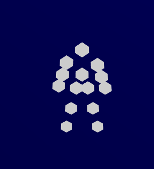

# three-skeletor

<p align="center">

</p>

Inverse Kinematics for three.js forked from
https://github.com/sneha-belkhale/THREE.IK/tree/hinge
and ported to typescript with breaking API changes. The primary purpose of this library is to support [aframe-skeletor](https://github.com/agoblinking/aframe-skeletor).

# **WARNING**

There is going to be some breaking API changes for bit until things settle down.


# Quick Start

```
npm install three-skeletor
```

or from latest builds are in /dst/

```js
import {
	IK,
	IKChain,
	IKJoint,
	IKBallConstraint,
	IKHelper,
} from 'three-skeletor'

// readme from https://github.com/jsantell/THREE.IK
// Set up scene, camera, renderer
const scene = new THREE.Scene()
const camera = new THREE.PerspectiveCamera(
	45,
	window.innerWidth / window.innerHeight,
	0.01,
	100
)
camera.position.z = 5
const renderer = new THREE.WebGLRenderer()
renderer.setPixelRatio(window.devicePixelRatio)
renderer.setSize(window.innerWidth, window.innerHeight)
document.body.appendChild(renderer.domElement)

const ik = new IK()

const chain = new IKChain()
const constraints = [new IKBallConstraint(90)]
const bones = []

// Create a target that the IK's effector will reach
// for.
const movingTarget = new THREE.Mesh(
	new THREE.SphereGeometry(0.1),
	new THREE.MeshBasicMaterial({ color: 0xff0000 })
)
movingTarget.position.z = 2
const pivot = new THREE.Object3D()
pivot.add(movingTarget)
scene.add(pivot)

// Create a chain of THREE.Bone's, each wrapped as an IKJoint
// and added to the IKChain
for (let i = 0; i < 10; i++) {
	const bone = new THREE.Bone()
	bone.position.y = i === 0 ? 0 : 0.5

	if (bones[i - 1]) {
		bones[i - 1].add(bone)
	}
	bones.push(bone)

	// The last IKJoint must be added with a `target` as an end effector.
	const target = i === 9 ? movingTarget : null
	chain.add(new IKJoint(bone, { constraints }), { target })
}

// Add the chain to the IK system
ik.add(chain)

// Ensure the root bone is added somewhere in the scene
scene.add(ik.getRootBone())

// Create a helper and add to the scene so we can visualize
// the bones
const helper = new IKHelper(ik)
scene.add(helper)

function animate() {
	pivot.rotation.x += 0.01
	pivot.rotation.y += 0.01
	pivot.rotation.z += 0.01

	ik.solve()

	renderer.render(scene, camera)

	requestAnimationFrame(animate)
}

animate()
```

# Usage

## [aframe-skeletor](https://github.com/agoblinking/aframe-skeletor)

Easy Inverse Kinematics for aframe.io

## [goblin-life](https://goblin.life/legend)

Used for character IK in [goblin.life](https://goblin.life)!
